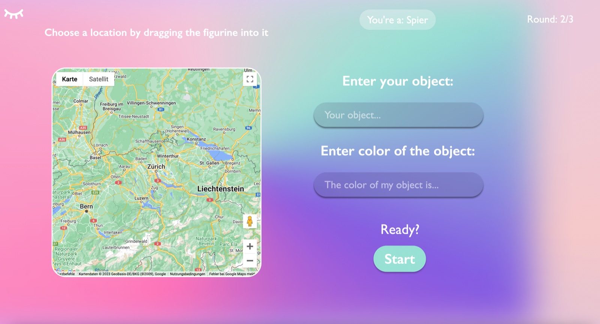
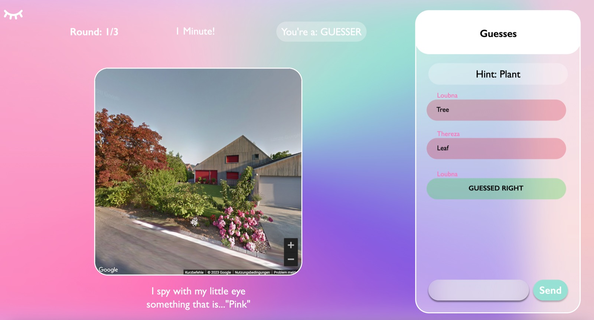

# I Spy With My Little Eye
<div style="text-align: justify"> 


By translating the childhood-favorite to the web, I Spy With My Little Eye is an exciting game where you can explore the
world with your friends online.
Check out the back-end implementation [here](https://github.com/sopra-fs23-group-09/SpyWithMyLittleEye_server).

## 📖 Table of Contents

1. [✨ Introduction](#introduction)
2. [🦋 Technologies](#technologies)
3. [🧩 High-level Components](#high-level-components)
4. [🚀 Launch & Development](#launch--development)
5. [🖼️ Illustrations](#illustrations)
6. [🚙 Roadmap](#roadmap)
7. [👩‍💻 Authors](#authors)
8. [🫂 Acknowledgments](#acknowledgments)
9. [🐙 Attributions](#attributions)
10. [©️ License](#license)

## ✨ Introduction <a name="introduction"></a>

I Spy With My Little Eye aims to rekindle childhood memories - Having an online version of this beloved game allows us
to explore the world with our friends online in a fun and exciting way.

## 🦋 Technologies <a id="technologies"></a>

During the development of the front-end, we used the following technologies:

* [JavaScript]() - Programming language
* [REACT](https://reactjs.org/) - Front-end JavaScript Library used mainly for Hooks
* [MUI](https://mui.com/material-ui/react-alert/) - React UI framework used mainly for Alert components
* [Axios API](https://axios-http.com/docs/api_intro) - Used for REST-based communication with the server
* [Stomp](https://stomp-js.github.io/stomp-websocket/) - Used for websocket communication with the server
* [Google Maps Streetview API](https://developers.google.com/maps/documentation/javascript/streetview?hl=de) - Used to embed streetview into the game

## 🧩 High-level Components <a id="high-level-components"></a>

Find the front-ends main 3 components below. What is their role?
How are they correlated? Reference the main class, file, or function in the README text
with a link.

### 🧑‍🤝‍🧑 Lobby

The host can create
a [Lobby](https://github.com/sopra-fs23-group-09/SpyWithMyLittleEye_client/blob/main/src/components/views/Lobby.js) with
1-20 rounds with each round taking 1-4 minutes. Up to 10 users can join it. If there are more than 2 in it, the host can decide to start the game, and all users will be redirected to the WaitingRoom. <br>
Users are informed about people joining / dropping out of the lobby or the host starting the game by a message sent to a Websocket Channel.
  
### 📍 Set Location

[SetLocation](https://github.com/sopra-fs23-group-09/SpyWithMyLittleEye_client/blob/main/src/components/views/SetLocation.js)
allows this rounds **SPIER** to select a place on a map and entering the keyword and the color for an object they want
the **GUESSERs** to find in the StreetView of the picked location.
<br>
This View interacts with the Google Maps and StreetView API. It also fetches data about the current round from the
server via a REST GET request. Once the **SPIER** has confirmed their choice, it is sent
to the backend using the websocket. The **GUESSERs** in the WaitingRoom are informed through a Websocket Channel
they are subscribed to, and redirected to the main part of the game: [Guessing](#-guessing).

### ⁉️ Guessing

[Guessing](https://github.com/sopra-fs23-group-09/SpyWithMyLittleEye_client/blob/main/src/components/views/Guessing.js)
is the view in which **GUESSERs** try to guess the object the **SPIER** picked in [SetLocation](#-set-location). Thus it
is the most important part of the game. Additionally,
the **SPIER** gives the **GUESSERs** hints to help them guess the correct answer quicker. **GUESSERs** can see the
guesses in a
chat.  <br>
The chat works through a websocket connection with the backend. Once the timer has elapsed or all **GUESSERs** have been
successful, the round is over and the players are redirected to [RoundOver]() or [GameOver](), depending on the round
one is currently in.

### ⏱️ RoundOver

[RoundOver](https://github.com/sopra-fs23-group-09/SpyWithMyLittleEye_client/blob/main/src/components/views/RoundOver.js)
is the View shown to users after they have finished playing the round (timer ran out, every GUESSER guessed correctly).
It shows an updated ranking of the top 3 users during this game. On this page, the host can choose to advance further by
clicking "Continue", and the other players will be redirected to the WaitingRoom.
  <br>
  Information about the Round is fetched using a REST request, and the players listen to a Websocket channel to know when the host is moving on to the next round.

### 🏆 Ranking

The [Ranking](https://github.com/sopra-fs23-group-09/SpyWithMyLittleEye_client/blob/main/src/components/views/Ranking.js)
features two leaderboards: one shows the top 15 players ranked by the total amount of points they have collected during
their accounts lifetime, and the other one shows the top 15 players ranked by the amount of games they have won. <br>
The data is fetched from the server using an GET request to the REST API.

### Additional Features

#### 🫀 Keep Alive

KeepAlive() / UserDropOut() arose due to the need of handling idle users or ones that close the tab during the game. While not a
component per-se, it still is a essential feature of this game to understand. Users get "kicked" from the game and logged out and their co-players are informed of this. <br>
However, this also makes it very important that the players have a **stable internet connection** as else they might be seen as inresponsive by the server.

#### 🔐 Token Authorization
In every REST request the client sends (except for login / register), and in every Websocket send / subscribe event, it includes the logged in users current token. This ensures all requests we make are authorized and prevents malicious use of our API / Websocket.

## 🚀 Launch & Development <a id="launch--development"></a>

These are the steps a new developer joining the team would
have to take to get started with the application.

### Prerequisites

As the application is mainly written in JavaScript, downloading [Node.js](https://nodejs.org) is needed. All other
dependencies, including React, get installed with:

```npm install```

Furthermore, you need to install the libraries used :

* MUI: `npm install @mui/material @emotion/react @emotion/styled`
* Google Maps: `npm install @googlemaps/js-api-loader`
* Iconify: `npm install --save-dev @iconify/react`
* Depending on your existing setup, you might need to install more.

### Commands to build and run the project locally

Start the app with: `npm run dev`

Open [http://localhost:3000](http://localhost:3000) to view it in the browser.

**We strongly recommend to use Google Chrome in full screen *only*, no matter if you have deployed the app or
are accessing it locally**.

### Tests

Run the tests with: `npm run test`

> For macOS user running into a 'fsevents' error: https://github.com/jest-community/vscode-jest/issues/423

### Build

To build the app, run `npm run build` <br>

### Deployment
Deployment to the Google App Engine happens automatically when pushed to main. 

### External dependencies

Both the client and the server have to be running for the application to behave as expected.

### Contributing
If you want to contribute, please contact the authors first. If you want to make changes to or add features, please do so on your own branch first and properly test it before submitting a pull request to the main repository. 

### Releases 
We recommend to follow this [tutorial](https://docs.github.com/en/repositories/releasing-projects-on-github/managing-releases-in-a-repository) and to properly document and comment your release. 

## 🖼️ Illustrations (TODO: insert new pictures) <a id="illustrations"></a>

At first, everyone gathers in a Lobby. <br>

<br>
Below we will briefly describe and illustrate the main user flow of our interface. <br>
A new round starts with the **SPIER**  selecting a place on Google Maps and choosing a random object on the Street View
of that location. <br>

<br>
Afterwards, the **GUESSERs** try to guess the object within the time limit. During the game incorrect guesses
are highlighted in red and correct ones in green. Correct guesses are not revealed to the other players, they just see
that a fellow player guessed correctly - so everyone can try to get it right!
<br>

Check out your place in the ranking and other players scores and profiles in Ranking!
<br>


## 🚙 Roadmap <a id="roadmap"></a>

* *Hard game mode*: When one person guesses correctly, the round is over
* *More metrics*: Allow the leaderboard to be filterable by other metrics (f.ex. fastest guessed)
* *Edit profile picture*

## 👩‍💻 Authors <a id="authors"></a>

* [Loubna Dia-Eddine](https://github.com/Loubnadia) - client
* [Ana Thereza Schiemer](https://github.com/athzsc) - client
* [Xena Wacker](https://github.com/xayreen) - client
* [Nina Emmermann](https://github.com/ninanni) - server
* [Claudia Anna Narang-Keller](https://github.com/cnaran) - server

## 🫂 Acknowledgments <a id="acknowledgements"></a>

We want to thank our Teaching Assistant [Sheena Lang](https://github.com/SheenaGit) for guiding us through the course.
We also couldn't have made it without our ✨ceremonies✨ 🍣✨ 🍱 🫶 after each Milestone.

## 🐙 Attributions <a id="attributions"></a>

We want to attribute the source that allowed us to use the cute handdrawn animal pictures!

* Birds: Images by <a href="https://www.freepik.com/free-vector/hand-drawn-cute-animal-avatars-element-set_32987087.htm">Freepik</a>
* Rabbit: Image by <a href="https://www.freepik.com/free-vector/animal-avatars-element-set_32987131.htm">Freepik</a>
* Bears: Images by <a href="https://www.freepik.com/free-vector/animal-avatars-element-pack_32987146.htm">Freepik</a>
* Sloth: Image by <a href="https://www.freepik.com/free-vector/hand-drawn-animal-avatars-element-pack_32987111.htm">Freepik</a>
* Cat: Gif by <a href="https://tenor.com/bM7wd.gif">Tenor</a>

## ©️ License <a id="license"></a>

This project is licensed under the GNU GPLv3 License. 

</div>
